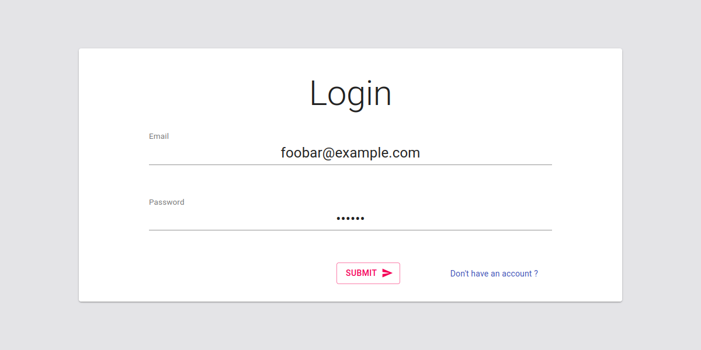

# Test People Vox

## Sommaire

Simple test de login / enregistrement par token JWT, avec: 

* React en front
* Graphql (Apollo) en back
* Cypress en test E2E
* Jest en test unitaire back
* Formik & Material Ui pour l'UI  
* (Yup pour la validation des formes côté front)

## Utilisation

1. `cd back && npm install && npm test`
2. `cd front && npm install && npm test`

## Considérations

L'authentification est faite par token JWT stocké dans le local storage du front. L'authentification est checké une première fois côté front, pour vérifier si le token a expirer (et donc, pas besoin de faire une requête), puis on check si le serveur accepte bien le token. 

La LUT (qui sert de BDD) stock les utilisateurs par Record<string,string> de type ["email"] : password. Si on veut faire quelque chose de plus complexe, il aurait fallu utiliser un index (ou un uuid) en guise de clé et stocker l'email ainsi que le mot de passe dans un objet javascript. 

Un soin particulier à été apporté sur l'organisation du code, en décorrélant au maximum la logique métier des vues, l'avantage de ceci étant d'avoir des composants purs permettant des tests d'UI plus facile (non effectuées ici).

## Pistes d'améliorations

* Améliorer l'UI du form:
  * Flex des bouttons
  * Couleurs (`UseTheme()` de Matérial UI ?)
* Faire une page `/home`
* Intégrer une BDD en back
* Utiliser `graphql code generator` pour typer les queries / mutations en front 

